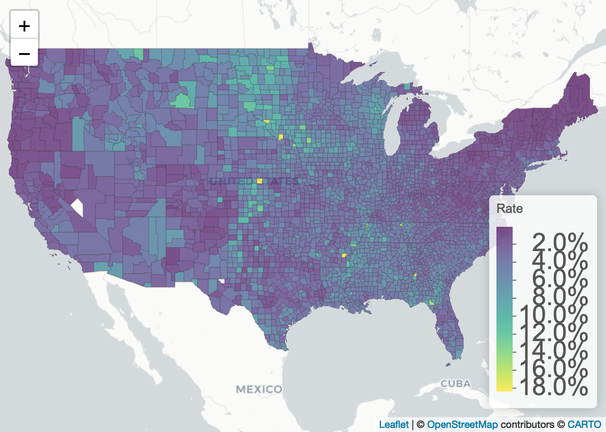

<!-- README.md is generated from README.Rmd. Please edit that file -->

# COVID-19 U.S. County Model

Bayesian model of COVID-19 cases in U.S. counties.

------------------------------------------------------------------------

## Data

The data is from the [COVID-19 Event Risk
Planner](https://github.com/appliedbinf/covid19-event-risk-planner),
which combines data from several sources including the [NYTimes COVID19
data project](https://github.com/nytimes/covid-19-data) and [U.S.
Census](https://www.census.gov/data/tables/time-series/demo/popest/2010s-state-total.html).
It includes U.S. county-level COVID-19 data such as number of cases,
deaths, and population.

## Stan Model

I fit a hierarchical binomial model for the counts of COVID-19 cases in
each U.S. county. The model treats each county as population members and
uses partial pooling to estimate county-level COVID-19 cases. Partial
pooling means the county-level COVID-19 probabilities are modeled by a
distribution. This allows for information sharing among these
parameters.

The Stan model is below:

``` stan
data {
  int<lower=0> N;     // counties
  int<lower=0> y[N];  // cases
  int<lower=0> K[N];  // populations
}
parameters {
  real<lower=0, upper=1> phi;  // population chance of covid
  real<lower=1> kappa;         // population concentration
  vector<lower=0, upper=1>[N] theta;  // chance of covid
}
model {
  kappa ~ pareto(1, 1.5);  // hyperprior
  theta ~ beta(phi * kappa, (1 - phi) * kappa); // prior
  y ~ binomial(K, theta); // likelihood
}
```

## Results

### COVID-19 Rate



### Residuals


